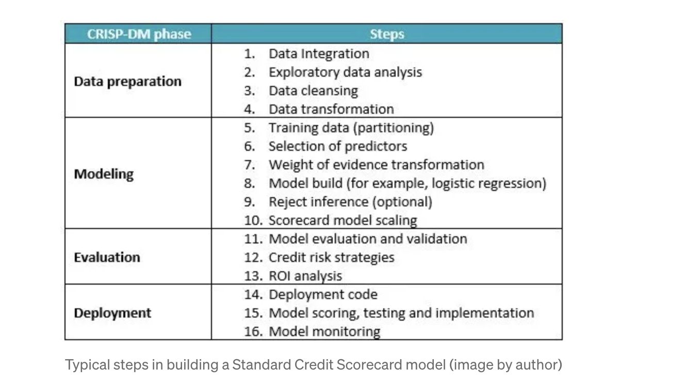

### Overview

In order to better approach the problem, I will spend some time reviewing
existing literature on credit risk modeling. At this point, I am particularly interested
in feature selection. We include notes relating to the domain of credit risk modeling
as well as feature selection in a more general sense.

### Resource: Credit Scoring by Natasha Mashanovich

https://medium.com/datadriveninvestor/credit-scoring-choose-the-modeling-methodology-right-part-2-13b5abad8ab6

Credit scoring is achieved by many methods. Recent techniques include the utilization of hundreds or thousands of models, ensemble techniques, etc. however, there is a tandout model called the credit scorecard model, based on logistic regression. Easy to build and execute. In fact, scorecard models are sometimes mandaded by regulators  in some countries for their explainability.

A scorecard model conssits of a set of attributes. Within an attribute, weighted points or scores are assigned to each attribute value. The sum of these scores is the final credit score.

Example: Take "age" as the attribute in question. For 0-25, the score is 10, for 26-40 the score is 25, etc.
This value will be added to that of the other attributes to obtain the final score.

External data, such as credit bureau data, dominate internal data for new customers.
Behavioral data, which is gathered from existing customers, has better predictive power than application scorecards.

Different scorecards are used throughout the customers time with the org as more data becomes available.
The new scorecards can be used to set credit limits or interest rates, etc.

Aside: I believe that I have both behavioral and credit data.

Garbage in, garbage out: Data preparation is key. It is also the most challenging and time-consuming part of the process.

- Aggregations, combination of different sources, transformations, cleansing.

Data should be relecant, accruate, consistent and complete, with sufficient and diverse volume.

Data exploration includes both univariate and bivariate analysis and ranges from univariate statistics and frequency distributions to correlations, cross-tabulation, and characteristic analysis.

cross-tabulation: A table, usually 2D, that shows the count of records have some combination of characteristics.

Ex                          | Where do you live?
Favorite Football team      | Kansas City | Denver  |
                Chiefs      |       15    |    3    |
                Broncos     |       5     |    20   |

Characteristic Analysis: Broad term, means lots of things.

Missing Data: 